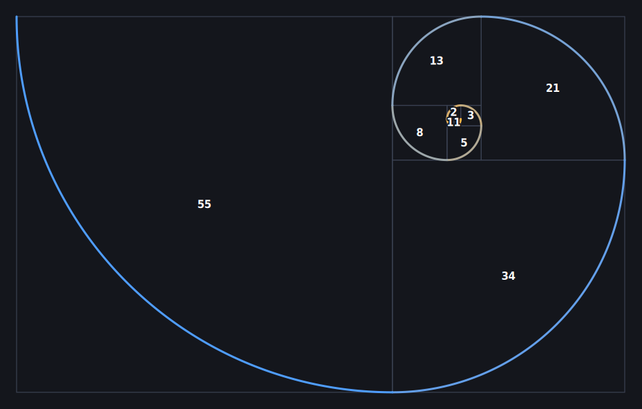

# Fibonacci Spiral Generator

A single, self-contained HTML page that draws a **Fibonacci spiral** on a
full-window canvas and lets you shape it live through a floating control panel.
No build step, no dependencies, no server — just open the file in a browser.

*The preview above was produced by the generator itself, using its default
settings.*

## Features

- **Live canvas rendering** of a true Fibonacci spiral, built from
  quarter-circle arcs that join smoothly at each step.
- **Floating, collapsible control panel** — pinned to the corner so you never
  scroll back and forth while experimenting. Click its header to collapse it.
- **Adjustable parameters:**
  - Segment count, overall scale, and line width
  - Rotation (0–360°) and winding direction (clockwise / counter-clockwise)
  - Spiral gradient (start + end color), background color
  - The classic tiling **squares** (toggle + color)
- **Fibonacci numbers**, with options to:
  - show/hide them,
  - place them **along the curve** or **inside the squares**,
  - keep a **fixed size** or **scale** each number to its square.
- **Transparent background** switch — exports with a real alpha channel.
- **Export** to **PNG** (raster, rendered at 2×) or **SVG** (true vector,
  editable in Inkscape/Illustrator). Each export is cropped to the drawing's own
  aspect ratio — landscape for a wide spiral, portrait for a tall one.

## Usage

1. Download or clone this repository.
2. Open [`fibonacci-spiral.html`](fibonacci-spiral.html) in any modern browser
   (double-click it, or drag it into a browser window).
3. Adjust the controls in the top-right panel. The image redraws instantly.
4. Click **Download PNG** or **Download SVG** to save your result.

There is nothing to install and no internet connection required — the entire
app is contained in that one HTML file.

## How it works

The spiral comes from the Fibonacci sequence (1, 1, 2, 3, 5, 8, 13, …). Each
number defines a square, and each square contributes one quarter-circle arc.
Because consecutive arc centers lie on the same radial line, the arcs meet with
a continuous position and tangent, producing the familiar smooth spiral.

The geometry is computed once in abstract "world units" and then mapped to the
screen (or to a cropped export canvas) by a single fit → scale → rotate
transform. The on-screen canvas and the SVG export share the same layout math
and label positions, so the exported file matches what you see on screen.

The code lives entirely in `fibonacci-spiral.html` and is organized into small,
commented functions: `buildGeometry`, `layout` / `exportLayout`, `numberLabels`,
`render` (canvas), and `buildSVG` (vector export).

## Browser support

Works in any current version of Chrome, Edge, Firefox, or Safari. Uses only
standard Canvas 2D, Blob downloads, and inline SVG — no polyfills needed.

## License

Released under the [MIT License](LICENSE). You're free to use, modify, and
share it.
